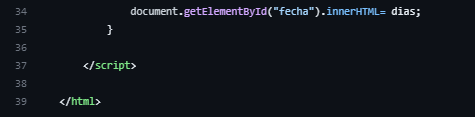
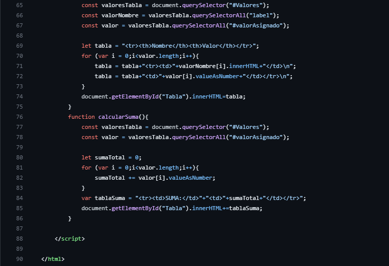

<table>
    <theader>
        <tr>
            <td></td>
            <th>
                UNIVERSIDAD NACIONAL DE SAN AGUSTIN 
                FACULTAD DE INGENIERÍA DE PRODUCCIÓN Y SERVICIOS 
                DEPARTAMENTO ACADÉMICO DE INGENIERÍA DE SISTEMAS E INFORMÁTICA 
                ESCUELA PROFESIONAL DE INGENIERÍA DE SISTEMAS
            </th>
            <td></td>
        </tr>
    </theader>
    <tbody>
        <tr><td colspan="3">Formato: Guía de Práctica de Laboratorio</td></tr>
        <tr><td>Aprobación:  2022/03/01</td><td>Código: GUIA-PRLD-001</td><td>Página: 1</td></tr>
    </tbody>
</table>

GUÍA DE LABORATORIO 

<table>
<theader>
<tr><th colspan="6">INFORMACIÓN BÁSICA</th></tr>
</theader>
<tbody>
<tr><td>ASIGNATURA:</td><td colspan="5">Programación Web 2</td></tr>
<tr><td>TÍTULO DE LA PRÁCTICA:</td><td colspan="5">JavaScript</td></tr>
<tr>
<td>NÚMERO DE PRÁCTICA:</td><td>02</td><td>AÑO LECTIVO:</td><td>2023 A</td><td>NRO. SEMESTRE:</td><td>III</td>
</tr>
<tr>
<td>FECHA DE PRESENTACION::</td><td>22/05/2023</td><td>HORA DE PRESENTACION:</td><td></td>
</tr>
<tr><td colspan="6">INTEGRANTE(S):
    <ul>
        <li>Chara Condori Jean Carlo</li>            
    </ul>
</td>
</<tr>
<tr><td colspan="6">DOCENTE(s):
<ul>
<li>Mg. Anibal Sardon Paniagua</li>
</ul>
</td>
</<tr>
</tdbody>
</table>

# JavaScript

## EJERCICIOS PROPUESTOS
- REPOSITORIO GITHUB: https://github.com/JeanChara/Pweb2-Lab02

- Ejercicio 01: Escriba una función que reciba el número de día de la fecha actual new Date() - https://www.w3schools.com/jsref/jsref_obj_date.asp y devuelva el texto del día de la semana correspondientes. Por ejemplo si recibe 0, devolvería “Domingo”. 

    **- Resolucion:**

    - 
    - 

    **- Ejecucion:**

    - 

- Ejercicio 02: Escriba una página web que reciba un texto y al presionar un botón muestre el mismo texto invertido en otra sección (div). Por ejemplo si se escribe “Hola”, se mostraría como “aloH”.

    **- Resolucion:**

    - 
    - 

    **- Ejecucion:**

    - 

- Ejercicio 03: Escribir una página que muestre cuántos días faltan para el día de Arequipa!

    **- Resolucion:**

    - 
    - 

    **- Ejecucion:**

    - 

- Ejercicio 04: Escribir un página que reciba el URL de la sesión de google meet de hoy y devuelva el código de la sesión sin guiones separadores

    **- Resolucion:**

    - 
    - 

    **- Ejecucion:**

    - 

- Ejercicio 05: Escribir una página que permita calcular las suma de todos los valores de una tabla de valores dinámica. La idea es crear una página web con un formulario que te permita decir cuantos valores tendrá la tabla, luego, al enviar el formulario la tabla se debe crear dinámicamente, junto con otro botón de envió para calcular la suma.

    **- Resolucion:**

    - 
    - 
    - 

    **- Ejecucion:**

    - 

- Ejercicio 06: Utilice la herramienta flipgrid - https://info.flipgrid.com/ envie un video en el tema "Presentacion y ejemplo deJavaScript" ponga aquí los enlaces de sus envíos.

    **- Link:**

    - Grupo: https://flip.com/46b3e747

    - 
    - 
#

## CUESTIONARIO
- Pruebe este código de arrayGenerator() en la página https://jslint.com/ 
- Revisar esta discusión en stackoverflow - https://stackoverflow.com/questions/4852017/how-to-initialize-an-arrays-length-in-javascript ¿Cómo se pueden resolver los warnings?

- ¿Se puede modificar la solución usando map? ¿Cómo?

#

**III. CONCLUSIONES**

En este laboratorio se ha repasado los conceptos de JavaScript, utilizando métodos del mismo.

**RETROALIMENTACIÓN GENERAL**

Repositorio en GitHub: https://github.com/JeanChara/Pweb2-Lab02

**REFERENCIAS Y BIBLIOGRAFÍA**

Repositorio en GitHub: https://github.com/JeanChara/Pweb2-Lab02
